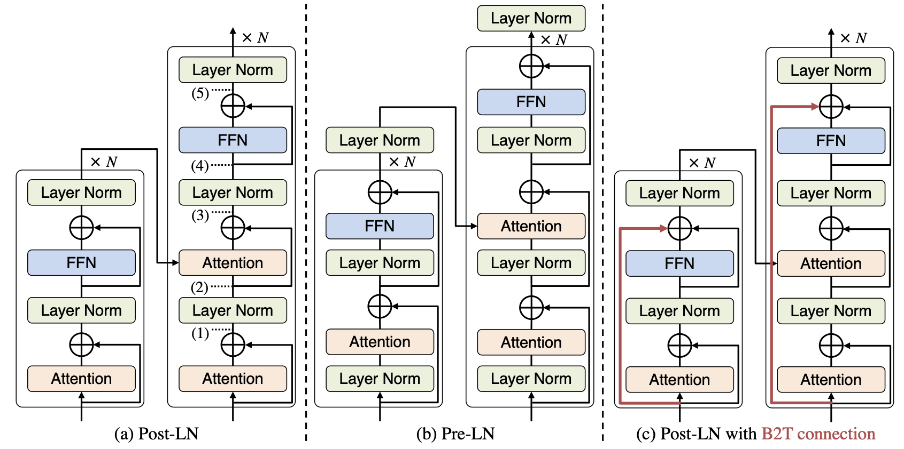

# B2T Connection: Serving Stability and Performance in Deep Transformers

This repository contains transformers with B2T connection proposed in our paper.
B2T connection mitigates unstable training property in Post-LN Transformers while maintaining all the advantages of Post-LN. Please check our paper for more details.

>[B2T Connection: Serving Stability and Performance in Deep Transformers](https://arxiv.org/abs/2206.00330)

>Sho Takase, Shun Kiyono, Sosuke Kobayashi, Jun Suzuki

>Proceedings of the Findings of ACL 2023



As an example, this document provides the way to train the 18L-18L Transformer with B2T connection on WMT En-De.


## Requirements and Installation

- PyTorch version == 1.11.0
- Python version >= 3.6

```bash
git clone https://github.com/takase/b2t_connection
cd b2t_connection
pip install --editable ./
```

## WMT En-De

### Training

##### 1. Download and pre-process datasets following the description in [this page](https://github.com/pytorch/fairseq/tree/master/examples/scaling_nmt)

##### 2. Train model

Run the following command on 8 GPUs.

```bash
python -u train.py \
    pre-processed-data-dir --source-lang en --target-lang de --fp16 \
    --arch transformer_wmt_en_de --optimizer adam --adam-betas '(0.9, 0.98)' \
    --clip-norm 0.1 --lr 0.001 --lr-scheduler inverse_sqrt --warmup-updates 4000 \
    --warmup-init-lr 1e-07 --dropout 0.5 --weight-decay 0.0 --criterion label_smoothed_cross_entropy \
    --label-smoothing 0.1 --max-tokens 3584 --min-lr 1e-09 --update-freq 16  --log-interval 100  --max-update 50000 \
    --sampling-method worddrop --enc-replace-rate 0.1 --dec-replace-rate 0.1 --decay-val 1000 \
    --share-all-embeddings --keep-last-epochs 10 --seed 1 --save-dir model-save-dir \
    --encoder-layers 18 --decoder-layers 18 --residual-bottom-to-top \
```

For 6L-6L, please set `--dropout` to 0.3, and remove `--sampling-method`, `--enc-replace-rate`, and `--dec-replace-rate` options.

For 100L-100L, please set `--max-update` to 25000.

### Test (decoding)

Averaging latest 10 checkpoints.

```bash
python scripts/average_checkpoints.py --inputs model-save-dir --num-epoch-checkpoints 10 --output model-save-dir/averaged.pt
```

Decoding with the averaged checkpoint.

```bash
python generate.py pre-processed-data-dir --path model-save-dir/averaged.pt  --beam 4 --lenpen 0.6 --remove-bpe | grep '^H' | sed 's/^H\-//g' | sort -t ' ' -k1,1 -n | cut -f 3- > generated.result
```

* We used ```--lenpen 0.6``` for newstest2014, and ```--lenpen 1.0``` for otherwise.


### Compute SacreBLEU score

Detokenize the generated result.

```bash
cat generated.result | $mosesscripts/tokenizer/detokenizer.perl -l de > generated.result.detok
```

* mosesscripts is the PATH to mosesdecoder/scripts

Compute SacreBLEU.

```bash
cat generated.result.detok | sacrebleu -t wmt14/full -l en-de
```

### 18L-18L Model Performance

Each model performance (SacreBLEU):

| Method | 2010 | 2011 | 2012 | 2013 | 2014 | 2015 | 2016 | Average |
| :--- | :--: | :--: | :--: | :--: | :--: | :--: | :--: | :--: |
| Pre-LN (from our paper) | 24.07| 21.98| 22.40| 26.28| 27.36| 29.74| 34.16| 26.57 |
| B2T connection | 25.27 | 22.67 | 23.49 | 27.25 | 28.25 | 30.60 | 35.09 | 27.52 |

Pre-trained models are [here](https://drive.google.com/file/d/1qYr2o8baOYXqOgSC-PvSlchbyCMIhE8C/view?usp=sharing)

## Acknowledgements
This repository is based on [our previous project](https://github.com/takase/rethink_perturbations/), whose large portion is borrowed from [fairseq](https://github.com/pytorch/fairseq).
